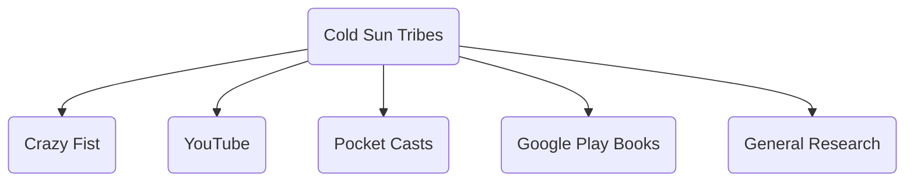

# Cold Sun Tribe

### Description
The Cold Sun Tribe is one of three tribes of lizardfolk living in the [[Q'Barra|Q'Barran Jungle]]. The tribes are split into twelve different sects that oversee a section of the jungle to oppose the forces of evil that would attempt to free the Overlord trapped in [[Haka'Torvhak]].

### Notable Members
##### Leader
- High Chieftan [[Drox]] of the Crazy Fist Cold Sun
##### Others
- Bruk (Hell Fox)
- Brazik (Red Hunt)
- Gask (Misty Forest)
- Tratlik (Quiet Rock)
- Jato (Molten Earth)
- Duroa (Twin Moon)
- Accuja  
- Ogoje  
- Thaz  
- Odra
- Hoz

### Ranks

### Organization Chart
